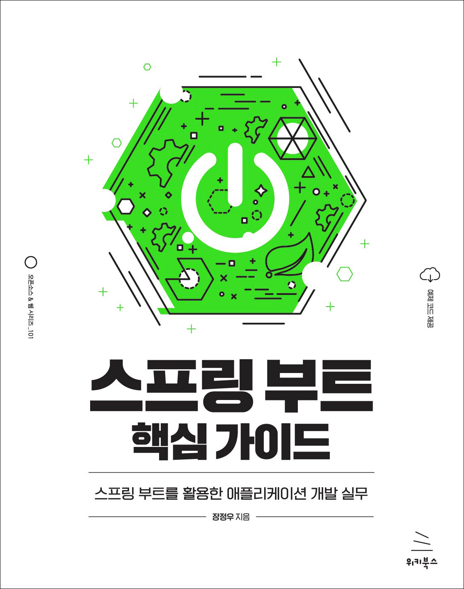

# 스프링 부트 핵심 가이드

- 장정우 지음
- 28,000원 | 2022년 6월 24일 발행 | 452쪽
- [책 홈페이지](https://wikibook.co.kr/springboot/)
- [도서 미리보기](http://www.yes24.com/Product/Viewer/Preview/110142898)
- [도서 관련 문의](https://wikibook.co.kr/support/contact/)

---

**입문자의 눈높이에 맞춰 차근차근 따라 하면서 배우는 스프링 부트 입문서!**

《스프링 부트 핵심 가이드》는 스프링 부트 기반의 애플리케이션을 개발할 때 필요한 기초적인 내용들을 소개하고, 스프링에서 제공하는 각종 라이브러리의 기능들을 이해할 수 있게 동작 원리를 상세히 설명합니다. 또한 ‘스프링 부트’다운 코드를 작성하는 방법에 초점을 맞춰 스프링 부트에서 제공하는 편의 기능들을 최대한 활용하고, 스프링 부트 기반의 애플리케이션을 어떻게 설계하고 구현하는지 안내합니다.
 
---
 
 ## 구입처
 
 - [예스24](http://www.yes24.com/Product/Goods/110142898)
 - [교보문고](http://www.kyobobook.co.kr/product/detailViewKor.laf?barcode=9791158393083)
 - [인터파크](https://book.interpark.com/product/BookDisplay.do?_method=detail&sc.prdNo=354806477)
 - [알라딘](https://www.aladin.co.kr/shop/wproduct.aspx?ItemId=296591989)
 
